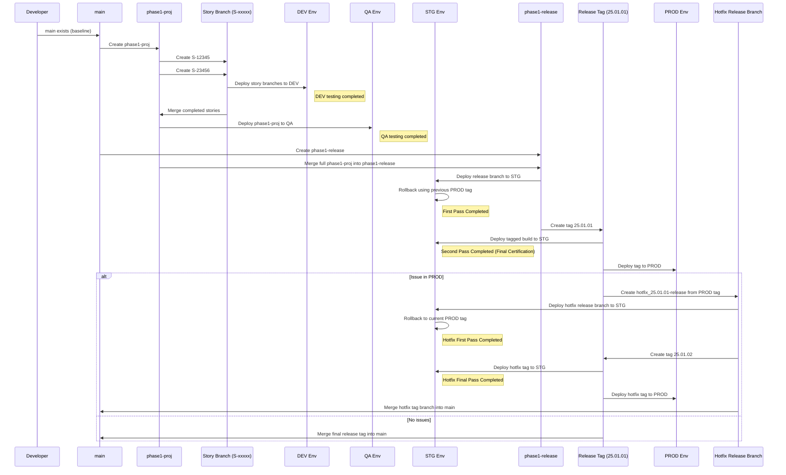
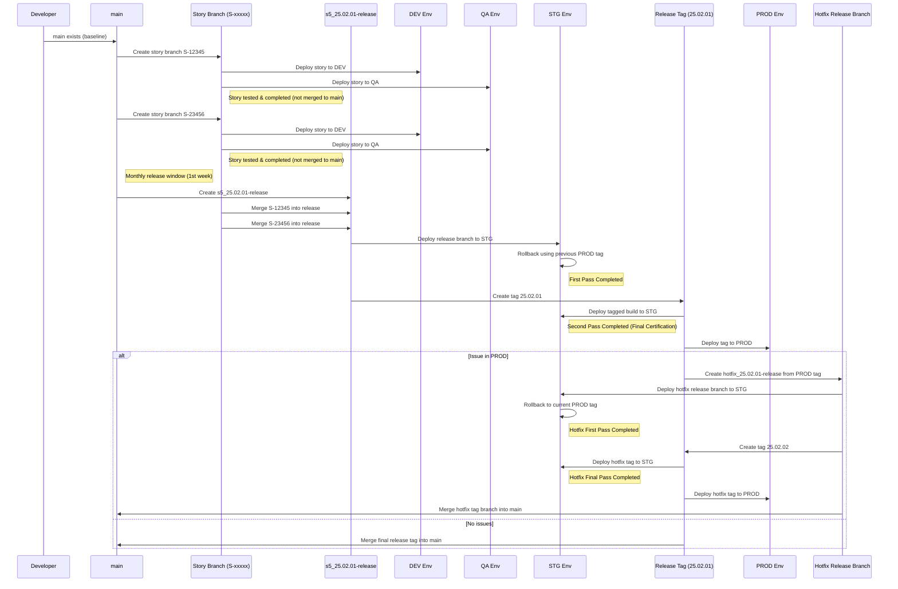

## Module Release

```mermaid
sequenceDiagram
    participant Dev as Developer
    participant Main as main
    participant Phase as phase1-proj
    participant Story as Story Branch (S-xxxxx)
    participant DEV as DEV Env
    participant QA as QA Env
    participant STG as STG Env
    participant Rel as phase1-release
    participant TAG as Release Tag (25.01.01)
    participant PROD as PROD Env
    participant HF as Hotfix Release Branch

    Dev->>Main: main exists (baseline)

    Main->>Phase: Create phase1-proj

    Phase->>Story: Create S-12345
    Phase->>Story: Create S-23456

    Story->>DEV: Deploy story branches to DEV
    Note right of DEV: DEV testing completed

    Story->>Phase: Merge completed stories
    Phase->>QA: Deploy phase1-proj to QA
    Note right of QA: QA testing completed

    Main->>Rel: Create phase1-release
    Phase->>Rel: Merge full phase1-proj into phase1-release

    Rel->>STG: Deploy release branch to STG
    STG->>STG: Rollback using previous PROD tag
    Note right of STG: First Pass Completed

    Rel->>TAG: Create tag 25.01.01
    TAG->>STG: Deploy tagged build to STG
    Note right of STG: Second Pass Completed (Final Certification)

    TAG->>PROD: Deploy tag to PROD

    alt Issue in PROD
        TAG->>HF: Create hotfix_25.01.01-release from PROD tag
        HF->>STG: Deploy hotfix release branch to STG
        STG->>STG: Rollback to current PROD tag
        Note right of STG: Hotfix First Pass Completed

        HF->>TAG: Create tag 25.01.02
        TAG->>STG: Deploy hotfix tag to STG
        Note right of STG: Hotfix Final Pass Completed

        TAG->>PROD: Deploy hotfix tag to PROD
        HF->>Main: Merge hotfix tag branch into main
    else No issues
        TAG->>Main: Merge final release tag into main
    end

```

## Bugs/Enhancements Release

```mermaid
sequenceDiagram
    participant Dev as Developer
    participant Main as main
    participant Story as Story Branch (S-xxxxx)
    participant Rel as s5_25.02.01-release
    participant DEV as DEV Env
    participant QA as QA Env
    participant STG as STG Env
    participant TAG as Release Tag (25.02.01)
    participant PROD as PROD Env
    participant HF as Hotfix Release Branch

    Dev->>Main: main exists (baseline)

    Main->>Story: Create story branch S-12345
    Story->>DEV: Deploy story to DEV
    Story->>QA: Deploy story to QA
    Note right of Story: Story tested & completed (not merged to main)

    Main->>Story: Create story branch S-23456
    Story->>DEV: Deploy story to DEV
    Story->>QA: Deploy story to QA
    Note right of Story: Story tested & completed (not merged to main)

    Note right of Main: Monthly release window (1st week)

    Main->>Rel: Create s5_25.02.01-release
    Story->>Rel: Merge S-12345 into release
    Story->>Rel: Merge S-23456 into release

    Rel->>STG: Deploy release branch to STG
    STG->>STG: Rollback using previous PROD tag
    Note right of STG: First Pass Completed

    Rel->>TAG: Create tag 25.02.01
    TAG->>STG: Deploy tagged build to STG
    Note right of STG: Second Pass Completed (Final Certification)

    TAG->>PROD: Deploy tag to PROD

    alt Issue in PROD
        TAG->>HF: Create hotfix_25.02.01-release from PROD tag
        HF->>STG: Deploy hotfix release branch to STG
        STG->>STG: Rollback to current PROD tag
        Note right of STG: Hotfix First Pass Completed

        HF->>TAG: Create tag 25.02.02
        TAG->>STG: Deploy hotfix tag to STG
        Note right of STG: Hotfix Final Pass Completed

        TAG->>PROD: Deploy hotfix tag to PROD
        HF->>Main: Merge hotfix tag branch into main
    else No issues
        TAG->>Main: Merge final release tag into main
    end
```
